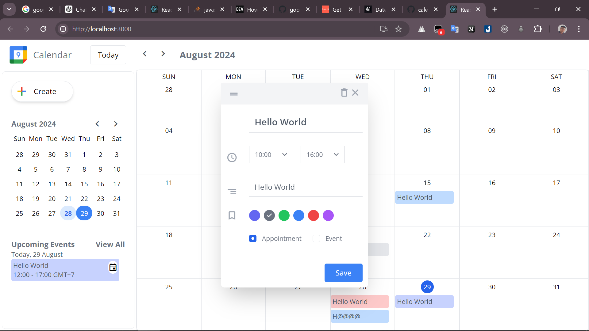
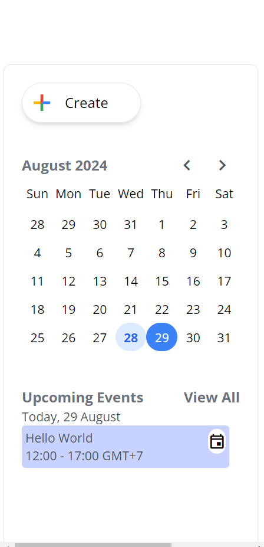
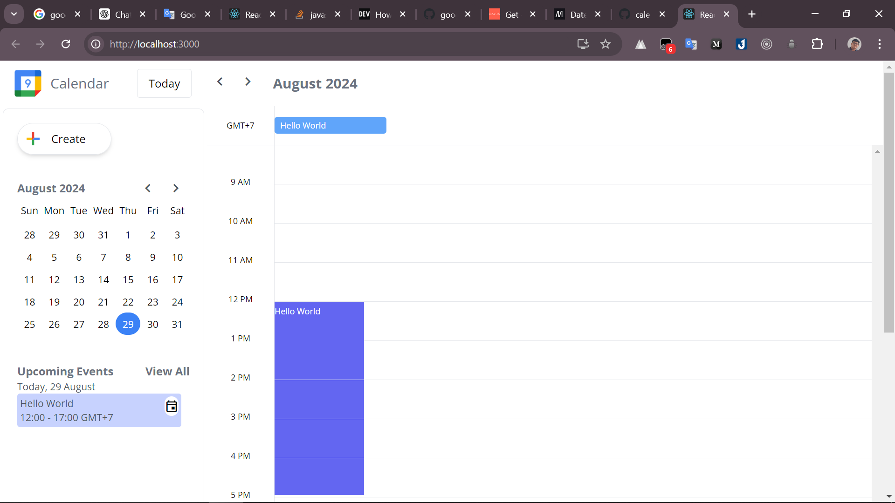

# Getting Started with Create React App

This project was bootstrapped with [Create React App](https://github.com/facebook/create-react-app).

## Available Scripts

In the project directory, you can run:

### `npm run start`

Runs the app in the development mode.\
Open [http://localhost:3000](http://localhost:3000) to view it in the browser.

The page will reload if you make edits.\
You will also see any lint errors in the console.

1. Data structure :
- The data structure use for project.
    title : string,
    description : string,
    startHour : string,
    endHour : string,
    selectedType: string,
    label: string,
    day: Date
- I'm not used back-end to store and return data .Instead, I used useContext in React to store and return Data. The reason is this project do not have much of type of data
- The reason why there is no need to use back-end is because this is a small project and the data is not too complex and using useContext is quite convenient and easy to use.
2. 
3. https://github.com/YarC7/calendar/tree/main
4. What i had learn from this project is how to work with time data type and how to handle it properly. Also need to deeply understand useContext so that i could handle these data.
5. If you could continue to develop this project , first i will use API from google so that i could create event for my google calendar account.Next , I will improve some UI and build some features like view as Week , Reminders Notification, ..etc